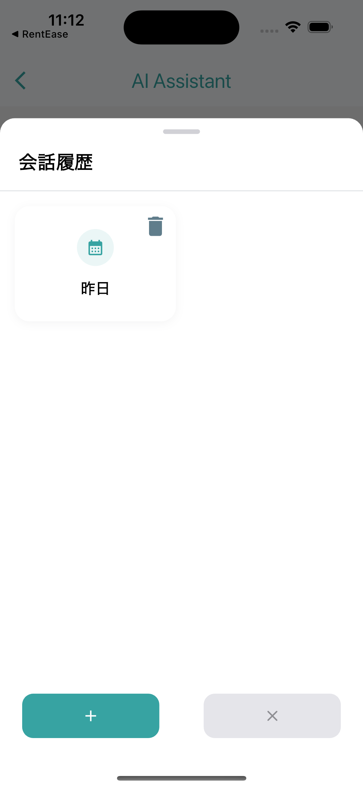

# Flutter Dify Chat Simple

## Actualizaciones
- **2025/04/02**: Se agregó almacenamiento con SharedPreferences para la persistencia de sesiones utilizando conversationID

<p float="left">
  
  
</p>

<details open>
<summary>Español</summary>

Un SDK simple de Flutter para integrar la API de Chat de [Dify.ai](https://dify.ai).

## Instalación
Agregue a su `pubspec.yaml`:
```yaml
dependencies:
  flutter_dify_chat_simple:
    path: ../flutter_dify_chat_simple  # Ruta local al SDK
```

## Uso
### Inicialización
```dart
import 'package:flutter_dify_chat_simple/flutter_dify_chat_simple.dart';

void main() {
  ChatBotSdk.initialize(
    apiKey: 'YOUR_DIFY_API_KEY',
    apiEndpoint: 'https://api.dify.ai/v1',
  );
  runApp(MyApp());
}
```

### Iniciar Chat
```dart
ChatBotSdk.startChat(
  context: context,
  title: 'Asistente de IA',
  initialMessage: '¡Hola! ¿En qué puedo ayudarte?',
  themeData: ThemeData(
    colorScheme: ColorScheme.fromSeed(
      seedColor: Colors.purple,
      brightness: Brightness.light,
    ),
  ),
  locale: const Locale('es'),
  thinkingWidget: myCustomThinkingWidget, // Widget personalizado opcional para "pensando"
);
```

### Widget Personalizado de "Pensando"

Puede personalizar la visualización del estado "pensando" cuando el asistente está generando una respuesta:

```dart
// Crear un widget personalizado de pensamiento
final customThinkingWidget = Container(
  padding: const EdgeInsets.all(8.0),
  child: Row(
    mainAxisSize: MainAxisSize.min,
    children: [
      SpinKitThreeBounce(
        color: Theme.of(context).colorScheme.primary,
        size: 18,
      ),
      const SizedBox(width: 8),
      Text(
        'La IA está pensando...',
        style: TextStyle(
          fontStyle: FontStyle.italic,
          color: Theme.of(context).colorScheme.primary,
        ),
      ),
    ],
  ),
);

// Úselo al iniciar un chat
ChatBotSdk.startChat(
  context: context,
  // ... otros parámetros
  thinkingWidget: customThinkingWidget,
);
```

Si no se proporciona, se mostrará el texto predeterminado "_Pensando..._".

## Configuración de la API de Dify
1. Cree una cuenta en Dify.ai y configure una aplicación de chat
2. Obtenga su clave API: App → API Access → Copiar API Key

</details>
