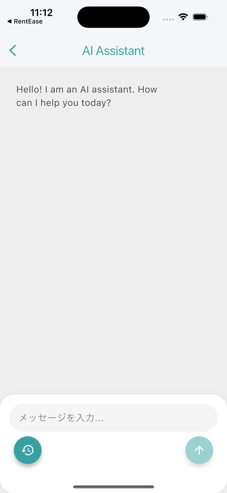
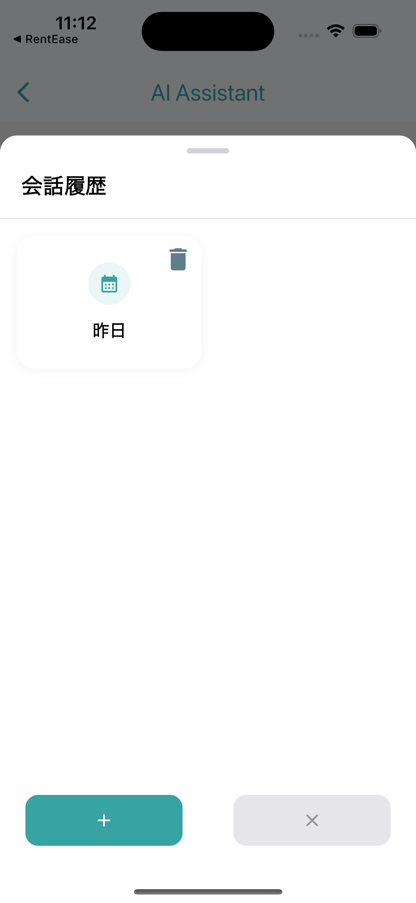

# Flutter Dify Chat Simple

## Updates
- **2025/04/02**: Added SharedPreferences storage for session persistence using conversationID

<p float="left">
  
  
</p>

<details open>
<summary>English</summary>

A simple Flutter SDK for integration with [Dify.ai](https://dify.ai) Chat API.

## Installation
Add to your `pubspec.yaml`:
```yaml
dependencies:
  flutter_dify_chat_simple:
    path: ../flutter_dify_chat_simple  # Local path to the SDK
```

## Usage
### Initialize
```dart
import 'package:flutter_dify_chat_simple/flutter_dify_chat_simple.dart';

void main() {
  ChatBotSdk.initialize(
    apiKey: 'YOUR_DIFY_API_KEY',
    apiEndpoint: 'https://api.dify.ai/v1',
  );
  runApp(MyApp());
}
```

### Launch Chat
```dart
ChatBotSdk.startChat(
  context: context,
  title: 'AI Assistant',
  initialMessage: 'Hello! How can I help you?',
  themeData: ThemeData(
    colorScheme: ColorScheme.fromSeed(
      seedColor: Colors.purple,
      brightness: Brightness.light,
    ),
  ),
  locale: const Locale('en'),
  thinkingWidget: myCustomThinkingWidget, // Optional custom "thinking" widget
);
```

### Custom Thinking Widget

You can customize the "thinking" state display when the assistant is generating a response:

```dart
// Create a custom thinking widget
final customThinkingWidget = Container(
  padding: const EdgeInsets.all(8.0),
  child: Row(
    mainAxisSize: MainAxisSize.min,
    children: [
      SpinKitThreeBounce(
        color: Theme.of(context).colorScheme.primary,
        size: 18,
      ),
      const SizedBox(width: 8),
      Text(
        'AI is thinking...',
        style: TextStyle(
          fontStyle: FontStyle.italic,
          color: Theme.of(context).colorScheme.primary,
        ),
      ),
    ],
  ),
);

// Use it when starting a chat
ChatBotSdk.startChat(
  context: context,
  // ... other parameters
  thinkingWidget: customThinkingWidget,
);
```

If not provided, the default "_Thinking..._" text will be displayed.

## Dify API Setup
1. Create a Dify.ai account and set up a chat application
2. Get your API key: App → API Access → Copy API Key

</details>

<details>
<summary>中文</summary>

一个用于集成 [Dify.ai](https://dify.ai) 聊天 API 的简易 Flutter SDK。

## 安装
添加到 `pubspec.yaml`:
```yaml
dependencies:
  flutter_dify_chat_simple:
    path: ../flutter_dify_chat_simple  # Local path to the SDK
```

## 使用方法
### 初始化
```dart
import 'package:flutter_dify_chat_simple/flutter_dify_chat_simple.dart';

void main() {
  ChatBotSdk.initialize(
    apiKey: 'YOUR_DIFY_API_KEY',
    apiEndpoint: 'https://api.dify.ai/v1',
  );
  runApp(MyApp());
}
```

### 启动聊天
```dart
ChatBotSdk.startChat(
  context: context,
  title: '智能助手',
  initialMessage: '您好！有什么可以帮您？',
  themeData: ThemeData(
    colorScheme: ColorScheme.fromSeed(
      seedColor: Colors.purple,
      brightness: Brightness.light,
    ),
  ),
  locale: const Locale('zh'),
  thinkingWidget: myCustomThinkingWidget, // 可选的自定义"思考中"组件
);
```

### 自定义思考状态组件

您可以自定义在助手生成回复时显示的"思考中"状态：

```dart
// 创建自定义思考组件
final customThinkingWidget = Container(
  padding: const EdgeInsets.all(8.0),
  child: Row(
    mainAxisSize: MainAxisSize.min,
    children: [
      SpinKitThreeBounce(
        color: Theme.of(context).colorScheme.primary,
        size: 18,
      ),
      const SizedBox(width: 8),
      Text(
        'AI 正在思考...',
        style: TextStyle(
          fontStyle: FontStyle.italic,
          color: Theme.of(context).colorScheme.primary,
        ),
      ),
    ],
  ),
);

// 在启动聊天时使用
ChatBotSdk.startChat(
  context: context,
  // ... 其他参数
  thinkingWidget: customThinkingWidget,
);
```

如果未提供，则将显示默认的"_正在思考..._"文本。

## Dify API 配置
1. 创建 Dify.ai 账户并设置聊天应用
2. 获取 API 密钥：App → API Access → 复制 API Key
</details>

<details>
<summary>日本語</summary>

[Dify.ai](https://dify.ai) Chat API と統合するためのシンプルな Flutter SDK。

## インストール
`pubspec.yaml` に追加:
```yaml
dependencies:
  flutter_dify_chat_simple:
    path: ../flutter_dify_chat_simple  # Local path to the SDK
```

## 使用方法
### 初期化
```dart
import 'package:flutter_dify_chat_simple/flutter_dify_chat_simple.dart';

void main() {
  ChatBotSdk.initialize(
    apiKey: 'YOUR_DIFY_API_KEY',
    apiEndpoint: 'https://api.dify.ai/v1',
  );
  runApp(MyApp());
}
```

### チャットの起動
```dart
ChatBotSdk.startChat(
  context: context,
  title: 'AI アシスタント',
  initialMessage: 'こんにちは！何かお手伝いできることはありますか？',
  themeData: ThemeData(
    colorScheme: ColorScheme.fromSeed(
      seedColor: Colors.purple,
      brightness: Brightness.light,
    ),
  ),
  locale: const Locale('ja'),
  thinkingWidget: myCustomThinkingWidget, // オプションのカスタム「考え中」ウィジェット
);
```

### カスタム考え中ウィジェット

アシスタントが応答を生成している間の「考え中」状態の表示をカスタマイズできます：

```dart
// カスタム考え中ウィジェットの作成
final customThinkingWidget = Container(
  padding: const EdgeInsets.all(8.0),
  child: Row(
    mainAxisSize: MainAxisSize.min,
    children: [
      SpinKitThreeBounce(
        color: Theme.of(context).colorScheme.primary,
        size: 18,
      ),
      const SizedBox(width: 8),
      Text(
        'AI が考え中...',
        style: TextStyle(
          fontStyle: FontStyle.italic,
          color: Theme.of(context).colorScheme.primary,
        ),
      ),
    ],
  ),
);

// チャット起動時に使用
ChatBotSdk.startChat(
  context: context,
  // ... その他のパラメーター
  thinkingWidget: customThinkingWidget,
);
```

提供されない場合は、デフォルトの「_考え中..._」テキストが表示されます。

## Dify API 設定
1. Dify.ai アカウントを作成し、チャットアプリケーションを設定
2. API キーの取得: App → API Access → API Key をコピー
</details>