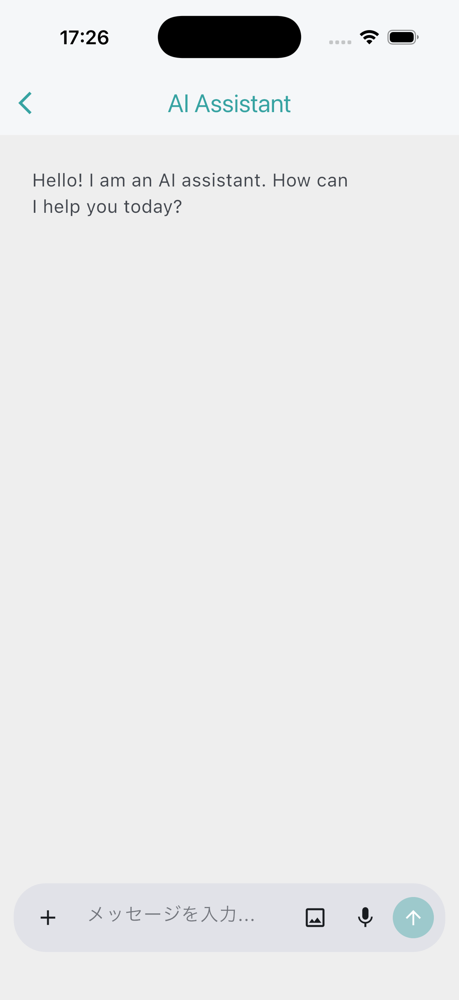

# Flutter Dify Chat Simple

## Updates
- **2026/09/09**: Configurable input bar (history / image / file / voice), ChatGPT-style composer, Dify file upload and speech-to-text, `ChatBotSdk.showHistory`
- **2025/04/02**: Added SharedPreferences storage for session persistence using conversationID

<p float="left">
  
</p>

<details open>
<summary>English</summary>

A simple Flutter SDK for integration with [Dify.ai](https://dify.ai) Chat API.

## Installation
Add to your `pubspec.yaml`:
```yaml
dependencies:
  flutter_dify_chat_simple:
    path: ../flutter_dify_chat_simple  # Local path to the SDK
```

## Usage
### Initialize
```dart
import 'package:flutter_dify_chat_simple/flutter_dify_chat_simple.dart';

void main() {
  ChatBotSdk.initialize(
    apiKey: 'YOUR_DIFY_API_KEY',
    apiEndpoint: 'https://api.dify.ai/v1',
  );
  runApp(MyApp());
}
```

### Launch Chat
```dart
ChatBotSdk.startChat(
  context: context,
  title: 'AI Assistant',
  userID: 'user-123',
  initialMessage: 'Hello! How can I help you?',
  themeData: ThemeData(
    colorScheme: ColorScheme.fromSeed(
      seedColor: Colors.purple,
      brightness: Brightness.light,
    ),
  ),
  locale: const Locale('en'),
  thinkingWidget: myCustomThinkingWidget, // Optional custom "thinking" widget
  emptyWidget: myCustomEmptyWidget, // Optional empty-state widget
  inputBarConfig: const ChatInputBarConfig(
    slot1: ChatInputSlot(action: ChatInputAction.history),
    slot2: ChatInputSlot(action: ChatInputAction.image),
    slot3: ChatInputSlot(action: ChatInputAction.voice),
  ),
);
```

`userID` is required (Dify `user` field). Pass `conversationId` to reopen an existing conversation.

### Custom Thinking Widget

You can customize the "thinking" state display when the assistant is generating a response:

```dart
// Create a custom thinking widget
final customThinkingWidget = Container(
  padding: const EdgeInsets.all(8.0),
  child: Row(
    mainAxisSize: MainAxisSize.min,
    children: [
      SpinKitThreeBounce(
        color: Theme.of(context).colorScheme.primary,
        size: 18,
      ),
      const SizedBox(width: 8),
      Text(
        'AI is thinking...',
        style: TextStyle(
          fontStyle: FontStyle.italic,
          color: Theme.of(context).colorScheme.primary,
        ),
      ),
    ],
  ),
);

// Use it when starting a chat
ChatBotSdk.startChat(
  context: context,
  // ... other parameters
  thinkingWidget: customThinkingWidget,
);
```

If not provided, the default "_Thinking..._" text will be displayed.

### Input bar

Three slots around the text field. Default: history / image / voice.

| Action | Behavior |
| --- | --- |
| `ChatInputAction.history` | Open conversation history |
| `ChatInputAction.image` | Pick from gallery or camera → `POST /files/upload` |
| `ChatInputAction.uploadFile` | Pick a file → `POST /files/upload` |
| `ChatInputAction.voice` | Record → `POST /audio-to-text`, insert transcript |
| `ChatInputAction.none` | Hide the slot |

Custom icon:

```dart
ChatInputSlot(
  action: ChatInputAction.history,
  custom: true,
  icon: Icon(Icons.add),
)
```

Composer:
- Inactive: one row (`slot1 | field | slot2 | slot3 | send`)
- Focused: one extra full-width text line above the tool row
- Longer text: previous expanded height, expand control top-right
- Expand: fullscreen; tap again to return

### Conversation history

```dart
ChatBotSdk.showHistory(
  context: context,
  userId: 'user-123',
  onConversationSelected: (conversationId) {
    ChatBotSdk.startChat(
      context: context,
      userID: 'user-123',
      conversationId: conversationId,
    );
  },
  onNewConversation: () { /* start a new chat */ },
);
```

`ChatBotSdk.getConversations(userId)` and `ChatBotSdk.deleteConversation(userId, conversationId)` are also available.

## Dify API Setup
1. Create a Dify.ai account and set up a chat application
2. Get your API key: App → API Access → Copy API Key
3. File attach: enable file upload on the app; vision/file understanding depends on the workflow
4. Voice: Features → Speech to Text (use Whisper; Hosted OpenAI GPT-4 trial is not STT)

## Host app permissions

iOS `Info.plist`:

- `NSMicrophoneUsageDescription` (voice)
- `NSCameraUsageDescription` (camera)
- `NSPhotoLibraryUsageDescription` (gallery)

</details>

<details>
<summary>中文</summary>

一个用于集成 [Dify.ai](https://dify.ai) 聊天 API 的简易 Flutter SDK。

## 安装
添加到 `pubspec.yaml`:
```yaml
dependencies:
  flutter_dify_chat_simple:
    path: ../flutter_dify_chat_simple  # Local path to the SDK
```

## 使用方法
### 初始化
```dart
import 'package:flutter_dify_chat_simple/flutter_dify_chat_simple.dart';

void main() {
  ChatBotSdk.initialize(
    apiKey: 'YOUR_DIFY_API_KEY',
    apiEndpoint: 'https://api.dify.ai/v1',
  );
  runApp(MyApp());
}
```

### 启动聊天
```dart
ChatBotSdk.startChat(
  context: context,
  title: '智能助手',
  userID: 'user-123',
  initialMessage: '您好！有什么可以帮您？',
  themeData: ThemeData(
    colorScheme: ColorScheme.fromSeed(
      seedColor: Colors.purple,
      brightness: Brightness.light,
    ),
  ),
  locale: const Locale('zh'),
  thinkingWidget: myCustomThinkingWidget, // 可选的自定义"思考中"组件
  emptyWidget: myCustomEmptyWidget, // 可选的空状态组件
  inputBarConfig: const ChatInputBarConfig(
    slot1: ChatInputSlot(action: ChatInputAction.history),
    slot2: ChatInputSlot(action: ChatInputAction.image),
    slot3: ChatInputSlot(action: ChatInputAction.voice),
  ),
);
```

`userID` 为必填（对应 Dify 的 `user`）。传入 `conversationId` 可打开已有会话。

### 自定义思考状态组件

您可以自定义在助手生成回复时显示的"思考中"状态：

```dart
// 创建自定义思考组件
final customThinkingWidget = Container(
  padding: const EdgeInsets.all(8.0),
  child: Row(
    mainAxisSize: MainAxisSize.min,
    children: [
      SpinKitThreeBounce(
        color: Theme.of(context).colorScheme.primary,
        size: 18,
      ),
      const SizedBox(width: 8),
      Text(
        'AI 正在思考...',
        style: TextStyle(
          fontStyle: FontStyle.italic,
          color: Theme.of(context).colorScheme.primary,
        ),
      ),
    ],
  ),
);

// 在启动聊天时使用
ChatBotSdk.startChat(
  context: context,
  // ... 其他参数
  thinkingWidget: customThinkingWidget,
);
```

如果未提供，则将显示默认的"_正在思考..._"文本。

### 输入栏

三个可配置按钮位。默认：历史 / 图片 / 语音。

| Action | 行为 |
| --- | --- |
| `ChatInputAction.history` | 打开会话历史 |
| `ChatInputAction.image` | 相册或相机 → `POST /files/upload` |
| `ChatInputAction.uploadFile` | 选择文件 → `POST /files/upload` |
| `ChatInputAction.voice` | 录音 → `POST /audio-to-text`，填入输入框 |
| `ChatInputAction.none` | 隐藏该位 |

自定义图标：

```dart
ChatInputSlot(
  action: ChatInputAction.history,
  custom: true,
  icon: Icon(Icons.add),
)
```

输入框：
- 未激活：一行（`slot1 | 输入 | slot2 | slot3 | 发送`）
- 激活：上方增加一整行满宽输入，按钮仍在原来那一行
- 字多：使用原来的展开高度，右上角可全屏
- 再点一次退出全屏

### 会话历史

```dart
ChatBotSdk.showHistory(
  context: context,
  userId: 'user-123',
  onConversationSelected: (conversationId) {
    ChatBotSdk.startChat(
      context: context,
      userID: 'user-123',
      conversationId: conversationId,
    );
  },
  onNewConversation: () { /* 新开聊天 */ },
);
```

也提供 `ChatBotSdk.getConversations(userId)` 和 `ChatBotSdk.deleteConversation(userId, conversationId)`。

## Dify API 配置
1. 创建 Dify.ai 账户并设置聊天应用
2. 获取 API 密钥：App → API Access → 复制 API Key
3. 发图/文件：在应用中开启文件上传；能否理解图片取决于工作流
4. 语音：功能 → 语音转文字（使用 Whisper；Hosted OpenAI GPT-4 trial 不是 STT）

## 宿主应用权限

iOS `Info.plist`：

- `NSMicrophoneUsageDescription`（语音）
- `NSCameraUsageDescription`（相机）
- `NSPhotoLibraryUsageDescription`（相册）

</details>

<details>
<summary>日本語</summary>

[Dify.ai](https://dify.ai) Chat API と統合するためのシンプルな Flutter SDK。

## インストール
`pubspec.yaml` に追加:
```yaml
dependencies:
  flutter_dify_chat_simple:
    path: ../flutter_dify_chat_simple  # Local path to the SDK
```

## 使用方法
### 初期化
```dart
import 'package:flutter_dify_chat_simple/flutter_dify_chat_simple.dart';

void main() {
  ChatBotSdk.initialize(
    apiKey: 'YOUR_DIFY_API_KEY',
    apiEndpoint: 'https://api.dify.ai/v1',
  );
  runApp(MyApp());
}
```

### チャットの起動
```dart
ChatBotSdk.startChat(
  context: context,
  title: 'AI アシスタント',
  userID: 'user-123',
  initialMessage: 'こんにちは！何かお手伝いできることはありますか？',
  themeData: ThemeData(
    colorScheme: ColorScheme.fromSeed(
      seedColor: Colors.purple,
      brightness: Brightness.light,
    ),
  ),
  locale: const Locale('ja'),
  thinkingWidget: myCustomThinkingWidget, // オプションのカスタム「考え中」ウィジェット
  emptyWidget: myCustomEmptyWidget, // オプションの空状態ウィジェット
  inputBarConfig: const ChatInputBarConfig(
    slot1: ChatInputSlot(action: ChatInputAction.history),
    slot2: ChatInputSlot(action: ChatInputAction.image),
    slot3: ChatInputSlot(action: ChatInputAction.voice),
  ),
);
```

`userID` は必須です（Dify の `user`）。`conversationId` を渡すと既存の会話を開けます。

### カスタム考え中ウィジェット

アシスタントが応答を生成している間の「考え中」状態の表示をカスタマイズできます：

```dart
// カスタム考え中ウィジェットの作成
final customThinkingWidget = Container(
  padding: const EdgeInsets.all(8.0),
  child: Row(
    mainAxisSize: MainAxisSize.min,
    children: [
      SpinKitThreeBounce(
        color: Theme.of(context).colorScheme.primary,
        size: 18,
      ),
      const SizedBox(width: 8),
      Text(
        'AI が考え中...',
        style: TextStyle(
          fontStyle: FontStyle.italic,
          color: Theme.of(context).colorScheme.primary,
        ),
      ),
    ],
  ),
);

// チャット起動時に使用
ChatBotSdk.startChat(
  context: context,
  // ... その他のパラメーター
  thinkingWidget: customThinkingWidget,
);
```

提供されない場合は、デフォルトの「_考え中..._」テキストが表示されます。

### 入力バー

テキスト欄の左右に 3 つのスロット。デフォルトは履歴 / 画像 / 音声。

| Action | 動作 |
| --- | --- |
| `ChatInputAction.history` | 会話履歴を開く |
| `ChatInputAction.image` | ギャラリーまたはカメラ → `POST /files/upload` |
| `ChatInputAction.uploadFile` | ファイル選択 → `POST /files/upload` |
| `ChatInputAction.voice` | 録音 → `POST /audio-to-text`、入力欄へ挿入 |
| `ChatInputAction.none` | スロットを非表示 |

カスタムアイコン：

```dart
ChatInputSlot(
  action: ChatInputAction.history,
  custom: true,
  icon: Icon(Icons.add),
)
```

入力欄：
- 非フォーカス：1 行（`slot1 | 入力 | slot2 | slot3 | 送信`）
- フォーカス：ツール行の上に満幅の 1 行を追加
- 文字が多いとき：従来の展開高さ、右上から全画面
- もう一度タップで全画面解除

### 会話履歴

```dart
ChatBotSdk.showHistory(
  context: context,
  userId: 'user-123',
  onConversationSelected: (conversationId) {
    ChatBotSdk.startChat(
      context: context,
      userID: 'user-123',
      conversationId: conversationId,
    );
  },
  onNewConversation: () { /* 新しいチャット */ },
);
```

`ChatBotSdk.getConversations(userId)` と `ChatBotSdk.deleteConversation(userId, conversationId)` も利用できます。

## Dify API 設定
1. Dify.ai アカウントを作成し、チャットアプリケーションを設定
2. API キーの取得: App → API Access → API Key をコピー
3. 画像/ファイル: アプリでファイルアップロードを有効化。画像理解はワークフロー次第
4. 音声: Features → Speech to Text（Whisper を使用。Hosted OpenAI GPT-4 trial は STT ではない）

## ホストアプリの権限

iOS `Info.plist`:

- `NSMicrophoneUsageDescription`（音声）
- `NSCameraUsageDescription`（カメラ）
- `NSPhotoLibraryUsageDescription`（ギャラリー）

</details>
